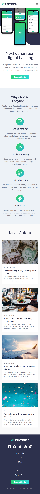

# Frontend Mentor - Easybank landing page solution

This is a solution to the [Easybank landing page challenge on Frontend Mentor](https://www.frontendmentor.io/challenges/easybank-landing-page-WaUhkoDN). Frontend Mentor challenges help you improve your coding skills by building realistic projects.

## Table of contents

- [Overview](#overview)
  - [The challenge](#the-challenge)
  - [Screenshot](#screenshot)
  - [Links](#links)
- [My process](#my-process)
  - [Built with](#built-with)
  - [Useful resources](#useful-resources)
- [Author](#author)
- [Acknowledgments](#acknowledgments)

## Overview

### The challenge

Users should be able to:

- View the optimal layout for the site depending on their device's screen size
- See hover states for all interactive elements on the page

### Screenshot

- Desktop version.  
  

- Mobile version.  
  

### Links

- Solution URL: [Github Link](https://github.com/Abaljerind/easybank-landing-page)
- Live Site URL: [Easybank Landing Page](https://easybank-landing-page-peach-seven.vercel.app/)

## My process

### Built with

- Semantic HTML5 markup
- Flexbox
- CSS Grid
- Responsive Website
- Mobile-first workflow
- React Icons
- Prettier
- Git & Github
- [React](https://reactjs.org/) - JS library
- [Vite](https://vite.dev/) - React framework
- [TailwindCSS](https://tailwindcss.com/) - CSS framework

### Useful resources

- [TailwindCSS](https://tailwindcss.com/) - This helped me to do the styling more easy. I really liked this tailwindcss and will use it going forward.
- [Vercel](https://vercel.com) - This is an amazing website which helped me to upload my website into the internet. I'd recommend it to anyone still learning to use this website.

## Author

- My Portfolio - [@Abaljerind](https://portofolio-jerind.vercel.app/)
- Github - [@Abaljerind](https://github.com/Abaljerind)
- LinkedIn - [@Abaljerind](https://www.linkedin.com/in/abal-jerind-baa90519a/)

## Acknowledgments

I want to thank me for believing in me, I want to thank me for doing all this hard work. I wanna thank me for having no days off. I wanna thank me for never quitting. I wanna thank me for being me at all times.
